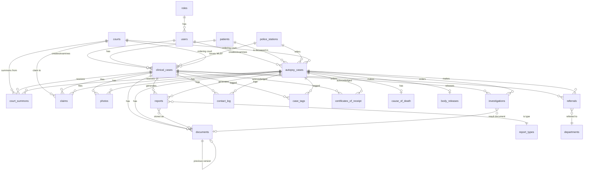

# FMDBS — Normalized Database Schema (3NF / BCNF)

> Derived from: `MLE Records NHK_be.accdb` · `PM Records NHK_be.accdb` · `FMDBS_SRS v1.0`
> Target RDBMS: **PostgreSQL**

---

## 1. Problems With the Current Access DB Schema

The existing Access DB has severe normalization violations:

### 1NF Violations
- `Tags` field stores comma-separated values in a single Memo field
- `Hurt` field stores free-text multi-valued injury descriptions
- Age stored across 3 separate columns (`Age_Years`, `Age_Months`, `Age_Days`) — all as **Text**, not integers

### 2NF Violations (Partial Dependencies)
- `MLE Records` has 36 columns. Fields like `Full_Name`, `Address`, `Contact_No` depend on the **patient**, not the case. If the same patient has multiple cases, their name is duplicated.
- `Reports` stores `Full_Name` (patient name) redundantly — it depends on `CME_No`, not `Report ID`.
- `Samples` stores `Full_Name` — same issue.

### 3NF Violations (Transitive Dependencies)
- `MLE Records.Police` → police station name, but `Contact_No_Police` depends on the **police station**, not the case. (Case → Police Station → Police Contact No).
- `PM Records.Courts` and `PM Records.TrialCourts` — court information (name, location) depends on the court entity, not the case.
- `Claim Summary` fields (`TRClaim_Date`, `TRClaim_Amount`) are embedded directly in `MLE Records` — they depend on the **claim**, not the case.
- Report generation timestamps (`MLRGeneratedOn`, `TOXGeneratedOn`, etc.) are separate columns in the main record — these should be rows in a related table.

### BCNF Violations
- `tblCODRules`: `Phrase → TargetBookmark` — if `TargetBookmark` determines `InsertText`, then there is a non-trivial FD where the determinant (`TargetBookmark`) is not a superkey.

### Other Issues
- No foreign key constraints enforced anywhere
- `Password` stored as plaintext `Text(255)`
- No audit trail table
- No normalized patient entity
- MLE and PM are completely separate databases with duplicated table structures

---

## 2. Functional Dependency Analysis

### Case Entity (Clinical)
```
case_id → mlef_no, patient_id, police_station_id, examining_doctor_id,
           examined_date, category, place, bht_no, ward, hospital,
           admission_datetime, produced_by, case_status, completed_on,
           sr_no, hurt_description, tags
```

### Case Entity (Autopsy)
```
case_id → pm_no, patient_id, case_no, inquest_no, police_station_id,
           examining_doctor_id, pm_date, place, verdict, mode,
           morgue_no, storage, date_of_death, time_of_death,
           date_of_mor_adm, time_of_mor_adm, done_by
```

### Patient
```
patient_id → full_name, nic, address, sex, age_years, age_months,
              age_days, contact_no, religion
```

### Police Station
```
police_station_id → station_name, contact_no, district
```

### Court
```
court_id → court_name, court_type, location
```

### Report (any type)
```
report_id → case_id, report_type, generated_on, dispatched_on,
             dispatched_to, dispatched_via, certificate_no, rc_no
```

### Investigation / Specimen
```
investigation_id → case_id, specimen_type, ix_no, ct_no, specimen_no,
                    date_sampled, sent_to, date_results, results,
                    discarded_on, status
```

### Document / Photo
```
document_id → case_id, doc_type, file_path, file_name, file_type,
               uploaded_by, uploaded_on, version, is_current
```

### Court Summons
```
summons_id → case_id, court_id, summons_date, summons_no,
              received_on, document_id
```

### Claim
```
claim_id → case_id, court_id, claim_type, amount, sent_on,
            received_on, status, voucher_no
```

### Referral
```
referral_id → case_id, department, doctor_name, referral_date,
               status, document_id, completed_on
```

### COD (Cause of Death — Autopsy only)
```
cod_id → case_id, cod_immediate, cod_1b, cod_1c, cod_1d,
          cod_2, generated_on
```

### Body Release (Autopsy only)
```
release_id → case_id, nok_name, nok_relationship, nok_nic,
              nok_contact, release_date, release_time, tech_name,
              dc_no, cemetery, religion
```

All the above are in **BCNF**: every determinant on the left is a candidate key (surrogate `_id`), and no non-key attribute depends on any other non-key attribute.

---

## 3. Normalized Schema (3NF / BCNF)

### Legend
- **PK** = Primary Key
- **FK** = Foreign Key
- **UQ** = Unique constraint
- **NN** = NOT NULL
- All tables use surrogate integer PKs (`SERIAL` / `BIGSERIAL`)

---

### 3.1 Core Identity Tables

#### `users`
| Column | Type | Constraints | Notes |
|--------|------|-------------|-------|
| user_id | SERIAL | PK | |
| username | VARCHAR(50) | UQ, NN | |
| password_hash | VARCHAR(255) | NN | bcrypt/Argon2 |
| full_name | VARCHAR(100) | NN | Display name |
| role_id | INT | FK → roles, NN | |
| is_active | BOOLEAN | NN, DEFAULT TRUE | |
| created_at | TIMESTAMPTZ | NN, DEFAULT NOW() | |

#### `roles`
| Column | Type | Constraints | Notes |
|--------|------|-------------|-------|
| role_id | SERIAL | PK | |
| role_name | VARCHAR(30) | UQ, NN | super_admin, doctor, clerk, lab_staff, photographer |
| description | TEXT | | |

#### `patients`
| Column | Type | Constraints | Notes |
|--------|------|-------------|-------|
| patient_id | SERIAL | PK | |
| full_name | VARCHAR(255) | NN | |
| nic | VARCHAR(20) | UQ | National ID — nullable for unidentified |
| passport_no | VARCHAR(30) | | |
| address | TEXT | | |
| sex | VARCHAR(10) | CHECK (sex IN ('Male','Female','Other','Unknown')) | |
| age_years | SMALLINT | CHECK (age_years >= 0) | |
| age_months | SMALLINT | CHECK (age_months BETWEEN 0 AND 11) | |
| age_days | SMALLINT | CHECK (age_days BETWEEN 0 AND 30) | |
| contact_no | VARCHAR(20) | | |
| religion | VARCHAR(50) | | |
| created_at | TIMESTAMPTZ | NN, DEFAULT NOW() | |

> **Normalization note:** Patient is now a first-class entity. A single patient can have multiple clinical and/or autopsy cases. Prevents name/address/NIC duplication across cases.

---

### 3.2 Reference / Lookup Tables

#### `police_stations`
| Column | Type | Constraints | Notes |
|--------|------|-------------|-------|
| station_id | SERIAL | PK | |
| station_name | VARCHAR(100) | UQ, NN | |
| contact_no | VARCHAR(20) | | |
| district | VARCHAR(100) | | |

#### `courts`
| Column | Type | Constraints | Notes |
|--------|------|-------------|-------|
| court_id | SERIAL | PK | |
| court_name | VARCHAR(150) | NN | |
| court_type | VARCHAR(30) | CHECK (court_type IN ('Magistrate','District','High','Supreme','Other')) | |
| location | VARCHAR(150) | | |

#### `departments` (for referrals)
| Column | Type | Constraints | Notes |
|--------|------|-------------|-------|
| department_id | SERIAL | PK | |
| department_name | VARCHAR(100) | UQ, NN | Psychiatry, Gynecology, ENT, etc. |

#### `report_types`
| Column | Type | Constraints | Notes |
|--------|------|-------------|-------|
| type_id | SERIAL | PK | |
| type_code | VARCHAR(20) | UQ, NN | MLR, TOX, STI, PSYCH, PMR, COD, HISTO, MICRO |
| type_name | VARCHAR(100) | NN | Full display name |
| applies_to | VARCHAR(10) | CHECK (applies_to IN ('clinical','autopsy','both')) | |

#### `cod_abbreviations` (autopsy COD lookup)
| Column | Type | Constraints | Notes |
|--------|------|-------------|-------|
| abbr_id | SERIAL | PK | |
| abbreviation | VARCHAR(50) | UQ, NN | |
| full_text | TEXT | NN | |
| area | VARCHAR(255) | | Anatomical area |
| is_active | BOOLEAN | NN, DEFAULT TRUE | |

#### `cod_rules` (autopsy COD template engine)
| Column | Type | Constraints | Notes |
|--------|------|-------------|-------|
| rule_id | SERIAL | PK | |
| phrase | VARCHAR(255) | NN | Trigger phrase |
| target_bookmark | VARCHAR(50) | NN | Template bookmark |
| insert_text | TEXT | NN | Text to insert |
| append_mode | BOOLEAN | NN, DEFAULT TRUE | |
| priority | SMALLINT | DEFAULT 0 | |
| is_active | BOOLEAN | NN, DEFAULT TRUE | |

---

### 3.3 Case Tables (Clinical + Autopsy)

#### `clinical_cases`
| Column | Type | Constraints | Notes |
|--------|------|-------------|-------|
| case_id | SERIAL | PK | |
| cme_no | VARCHAR(30) | UQ, NN | Internal reference number |
| mlef_no | VARCHAR(30) | UQ | Police-issued MLEF number |
| patient_id | INT | FK → patients, NN | |
| patient_type | VARCHAR(15) | NN, CHECK (patient_type IN ('Inward','Outpatient')) | |
| bht_no | VARCHAR(30) | | Nullable for outpatients |
| ward | VARCHAR(50) | | |
| hospital | VARCHAR(100) | | |
| admission_datetime | TIMESTAMPTZ | | |
| police_station_id | INT | FK → police_stations | |
| police_officer_name | VARCHAR(100) | | |
| police_officer_reg_no | VARCHAR(30) | | |
| police_contact_no | VARCHAR(20) | | |
| produced_by | VARCHAR(100) | | Who brought the patient |
| examining_doctor_id | INT | FK → users, NN | |
| examined_date | DATE | NN | |
| place_of_examination | VARCHAR(255) | | |
| category | VARCHAR(50) | | RTA, Assault, Sexual Abuse, etc. |
| reason_for_examination | TEXT | | |
| hurt_description | TEXT | | Free-text injury |
| sr_no | VARCHAR(30) | | Serial register number |
| case_status | VARCHAR(30) | NN, DEFAULT 'Open' | Open → Report Generated → Dispatched → Closed |
| completed_on | TIMESTAMPTZ | | |
| ordering_court_id | INT | FK → courts | Magistrate court that issued MLEF |
| trial_court_id | INT | FK → courts | Court where doctor testifies |
| case_no | VARCHAR(30) | | Court case number |
| created_at | TIMESTAMPTZ | NN, DEFAULT NOW() | |
| created_by | INT | FK → users, NN | |

#### `autopsy_cases`
| Column | Type | Constraints | Notes |
|--------|------|-------------|-------|
| case_id | SERIAL | PK | |
| pm_no | VARCHAR(30) | UQ, NN | Post-mortem serial number |
| morgue_no | VARCHAR(30) | | |
| patient_id | INT | FK → patients, NN | Deceased |
| inquest_no | VARCHAR(30) | | |
| case_no | VARCHAR(50) | | Court case number |
| police_station_id | INT | FK → police_stations | |
| police_officer_name | VARCHAR(100) | | |
| police_contact_no | VARCHAR(15) | | |
| examining_doctor_id | INT | FK → users, NN | |
| pm_date | DATE | | |
| place_of_pm | VARCHAR(255) | | |
| date_of_death | DATE | | |
| time_of_death | TIME | | |
| date_of_admission | DATE | | Hospital admission if hospital death |
| time_of_admission | TIME | | |
| date_of_mor_adm | DATE | | Morgue admission |
| time_of_mor_adm | TIME | | |
| bht_no | VARCHAR(250) | | If hospital death |
| ward | VARCHAR(50) | | |
| phn_no | VARCHAR(50) | | Preliminary hospital number |
| is_hospital_death | BOOLEAN | DEFAULT FALSE | |
| done_by | VARCHAR(100) | | |
| tech_1 | VARCHAR(100) | | Assisting technician 1 |
| tech_2 | VARCHAR(100) | | Assisting technician 2 |
| mode | VARCHAR(100) | | Mode of death |
| storage | VARCHAR(100) | | Body storage |
| dd_no | VARCHAR(50) | | |
| verdict | VARCHAR(30) | CHECK (verdict IN ('Accident','Suicide','Homicide','Natural','Open','Undetermined')) | |
| ordering_court_id | INT | FK → courts | |
| trial_court_id | INT | FK → courts | |
| trial_case_no | VARCHAR(50) | | |
| case_status | VARCHAR(30) | NN, DEFAULT 'Open' | |
| created_at | TIMESTAMPTZ | NN, DEFAULT NOW() | |
| created_by | INT | FK → users, NN | |

---

### 3.4 Case-Linked Entities (Shared by Clinical & Autopsy)

> These tables use a **polymorphic FK pattern**: `case_type` + `case_id` pointing to either `clinical_cases` or `autopsy_cases`. Alternatively, a common `cases` supertype table can be used — see note at end.

#### `documents`
| Column | Type | Constraints | Notes |
|--------|------|-------------|-------|
| document_id | SERIAL | PK | |
| case_type | VARCHAR(10) | NN, CHECK (case_type IN ('clinical','autopsy')) | |
| case_id | INT | NN | FK to clinical_cases or autopsy_cases |
| doc_category | VARCHAR(30) | NN | MLEF_scan, PMR_scan, Photograph, Xray_CT, Lab_report, Toxicology, Histology, Court_order, Summons, Certificate, Referral, Other |
| file_path | VARCHAR(500) | NN | |
| file_name | VARCHAR(255) | NN | |
| file_mime_type | VARCHAR(50) | | |
| file_size_bytes | BIGINT | | |
| version | SMALLINT | NN, DEFAULT 1 | |
| is_current | BOOLEAN | NN, DEFAULT TRUE | |
| previous_version_id | INT | FK → documents | Self-referential for version chain |
| uploaded_by | INT | FK → users, NN | |
| uploaded_at | TIMESTAMPTZ | NN, DEFAULT NOW() | |
| is_locked | BOOLEAN | NN, DEFAULT FALSE | Read-only after confirmation |

> **3NF note:** `file_name` does NOT determine `file_path` — different uploads can have the same filename in different storage paths. No transitive dependency.

#### `photos`
| Column | Type | Constraints | Notes |
|--------|------|-------------|-------|
| photo_id | SERIAL | PK | |
| case_type | VARCHAR(10) | NN | |
| case_id | INT | NN | |
| photo_category | VARCHAR(30) | | External, Internal, Crime_scene, Other |
| file_path | VARCHAR(500) | NN | |
| file_name | VARCHAR(255) | NN | |
| taken_at | TIMESTAMPTZ | | Date/time photo was taken |
| annotation | TEXT | | |
| uploaded_by | INT | FK → users, NN | |
| uploaded_at | TIMESTAMPTZ | NN, DEFAULT NOW() | |
| is_locked | BOOLEAN | NN, DEFAULT FALSE | |

#### `reports`
| Column | Type | Constraints | Notes |
|--------|------|-------------|-------|
| report_id | SERIAL | PK | |
| case_type | VARCHAR(10) | NN | |
| case_id | INT | NN | |
| report_type_id | INT | FK → report_types, NN | |
| generated_on | TIMESTAMPTZ | | When report was generated |
| generated_by | INT | FK → users | |
| dispatched_on | DATE | | |
| dispatched_to | VARCHAR(100) | | Recipient name/court |
| dispatched_via | VARCHAR(50) | | Method (post, hand, etc.) |
| certificate_no | VARCHAR(50) | | Report certificate number |
| rc_no | VARCHAR(50) | | Receipt certificate number |
| document_id | INT | FK → documents | Link to the generated PDF |
| is_finalized | BOOLEAN | NN, DEFAULT FALSE | |
| is_locked | BOOLEAN | NN, DEFAULT FALSE | |

> **3NF note:** `report_type_id` is a FK to a lookup table, not a text field. Eliminates transitive dependency where `report_type_name` would depend on `report_type_id`, not `report_id`.

#### `investigations`
| Column | Type | Constraints | Notes |
|--------|------|-------------|-------|
| investigation_id | SERIAL | PK | |
| case_type | VARCHAR(10) | NN | |
| case_id | INT | NN | |
| specimen_type | VARCHAR(100) | NN | Blood, Urine, Tissue, Swab, etc. |
| specimen_no | SMALLINT | | |
| ix_no | VARCHAR(30) | | Investigation number |
| ct_no | VARCHAR(30) | | CT scan number |
| date_sampled | DATE | | |
| sent_to | VARCHAR(100) | | Lab/institution |
| date_results | DATE | | |
| results | TEXT | | |
| result_document_id | INT | FK → documents | Scanned result |
| status | VARCHAR(20) | NN, DEFAULT 'Ordered' | Ordered → Pending → Completed |
| discarded_on | DATE | | When specimen was discarded |
| created_by | INT | FK → users, NN | |
| created_at | TIMESTAMPTZ | NN, DEFAULT NOW() | |
| is_locked | BOOLEAN | NN, DEFAULT FALSE | |

#### `referrals`
| Column | Type | Constraints | Notes |
|--------|------|-------------|-------|
| referral_id | SERIAL | PK | |
| case_type | VARCHAR(10) | NN | |
| case_id | INT | NN | |
| department_id | INT | FK → departments, NN | Psychiatry, Gynecology, etc. |
| referred_doctor_name | VARCHAR(100) | | |
| referral_date | DATE | NN | |
| referral_document_id | INT | FK → documents | Generated referral letter |
| response_document_id | INT | FK → documents | Uploaded referral response |
| status | VARCHAR(20) | NN, DEFAULT 'Pending' | Pending → Completed |
| completed_on | DATE | | |
| created_by | INT | FK → users, NN | |
| is_locked | BOOLEAN | NN, DEFAULT FALSE | |

> **New table** — the Access DB had no referral-specific table; referrals were mixed into `Samples` and `Contact Log`.

#### `court_summons`
| Column | Type | Constraints | Notes |
|--------|------|-------------|-------|
| summons_id | SERIAL | PK | |
| case_type | VARCHAR(10) | NN | |
| case_id | INT | NN | |
| court_id | INT | FK → courts | |
| summons_date | DATE | | Date of appearance |
| summons_no | VARCHAR(50) | | Yomu Ankaya / issue number |
| received_on | DATE | | When received at department |
| document_id | INT | FK → documents | Scanned summons |
| summoned_doctor_id | INT | FK → users | |
| created_at | TIMESTAMPTZ | NN, DEFAULT NOW() | |

#### `certificates_of_receipt`
| Column | Type | Constraints | Notes |
|--------|------|-------------|-------|
| cert_id | SERIAL | PK | |
| case_type | VARCHAR(10) | NN | |
| case_id | INT | NN | |
| report_id | INT | FK → reports | Which report was acknowledged |
| received_date | DATE | | |
| document_id | INT | FK → documents | Scanned certificate |
| created_at | TIMESTAMPTZ | NN, DEFAULT NOW() | |

#### `claims`
| Column | Type | Constraints | Notes |
|--------|------|-------------|-------|
| claim_id | SERIAL | PK | |
| case_type | VARCHAR(10) | NN | |
| case_id | INT | NN | |
| court_id | INT | FK → courts | |
| claim_type | VARCHAR(50) | | Travel, Attendance, etc. |
| amount | DECIMAL(10,2) | | |
| sent_on | DATE | | |
| received_on | DATE | | |
| status | VARCHAR(20) | DEFAULT 'Pending' | Pending → Sent → Received → Paid |
| voucher_no | VARCHAR(50) | | Voucher or cheque number |
| created_at | TIMESTAMPTZ | NN, DEFAULT NOW() | |

#### `contact_log`
| Column | Type | Constraints | Notes |
|--------|------|-------------|-------|
| log_id | SERIAL | PK | |
| case_type | VARCHAR(10) | NN | |
| case_id | INT | NN | |
| contact_person | VARCHAR(100) | | Who contacted |
| contact_no | VARCHAR(20) | | |
| reference | VARCHAR(100) | | |
| contents | TEXT | | What was discussed |
| actions | TEXT | | Actions taken |
| logged_by | INT | FK → users | |
| logged_at | TIMESTAMPTZ | NN, DEFAULT NOW() | |

---

### 3.5 Autopsy-Specific Tables

#### `cause_of_death`
| Column | Type | Constraints | Notes |
|--------|------|-------------|-------|
| cod_id | SERIAL | PK | |
| case_id | INT | FK → autopsy_cases, UQ, NN | One COD per autopsy case |
| cod_immediate | TEXT | | 1(a) immediate cause |
| cod_1b | TEXT | | 1(b) antecedent cause |
| cod_1c | TEXT | | 1(c) antecedent cause |
| cod_1d | TEXT | | 1(d) antecedent cause |
| cod_2 | TEXT | | Part 2: other significant conditions |
| maternal_death | BOOLEAN | DEFAULT FALSE | |
| specimens_retained | TEXT | | |
| comments | TEXT | | |
| generated_on | TIMESTAMPTZ | | |
| generated_by | INT | FK → users | |
| document_id | INT | FK → documents | Generated COD PDF |
| is_finalized | BOOLEAN | NN, DEFAULT FALSE | |

#### `body_releases`
| Column | Type | Constraints | Notes |
|--------|------|-------------|-------|
| release_id | SERIAL | PK | |
| case_id | INT | FK → autopsy_cases, UQ, NN | One release per case |
| nok_name | VARCHAR(255) | | Next of kin |
| nok_relationship | VARCHAR(50) | | |
| nok_nic | VARCHAR(20) | | |
| nok_contact | VARCHAR(20) | | |
| release_date | DATE | | |
| release_time | TIME | | |
| releasing_tech | VARCHAR(100) | | |
| dc_no | VARCHAR(30) | | Death certificate number |
| cemetery | TEXT | | |
| created_at | TIMESTAMPTZ | NN, DEFAULT NOW() | |

---

### 3.6 System Tables

#### `audit_log`
| Column | Type | Constraints | Notes |
|--------|------|-------------|-------|
| log_id | BIGSERIAL | PK | |
| user_id | INT | FK → users | |
| action | VARCHAR(20) | NN | CREATE, READ, UPDATE, DELETE |
| table_name | VARCHAR(50) | NN | |
| record_id | INT | | |
| old_value | JSONB | | Previous state |
| new_value | JSONB | | New state |
| ip_address | INET | | |
| timestamp | TIMESTAMPTZ | NN, DEFAULT NOW() | |

#### `notifications`
| Column | Type | Constraints | Notes |
|--------|------|-------------|-------|
| notif_id | BIGSERIAL | PK | |
| user_id | INT | FK → users, NN | Recipient |
| case_type | VARCHAR(10) | | |
| case_id | INT | | |
| notif_type | VARCHAR(50) | NN | court_reminder, report_overdue, new_case, etc. |
| title | VARCHAR(255) | NN | |
| message | TEXT | | |
| is_read | BOOLEAN | NN, DEFAULT FALSE | |
| created_at | TIMESTAMPTZ | NN, DEFAULT NOW() | |

#### `case_tags` (resolves 1NF violation — multi-valued `Tags` field)
| Column | Type | Constraints | Notes |
|--------|------|-------------|-------|
| tag_id | SERIAL | PK | |
| case_type | VARCHAR(10) | NN | |
| case_id | INT | NN | |
| tag | VARCHAR(50) | NN | |
| | | UQ(case_type, case_id, tag) | No duplicate tags per case |

#### `audio_recordings` (new capability from SRS)
| Column | Type | Constraints | Notes |
|--------|------|-------------|-------|
| recording_id | SERIAL | PK | |
| case_type | VARCHAR(10) | NN | |
| case_id | INT | NN | |
| file_path | VARCHAR(500) | NN | |
| duration_secs | INT | | |
| transcript | TEXT | | Generated transcript |
| recorded_by | INT | FK → users | |
| recorded_at | TIMESTAMPTZ | NN | |

---

## 4. Entity-Relationship Diagram



---

## 5. Normalization Verification

| Normal Form | Satisfied? | Rationale |
|-------------|-----------|-----------|
| **1NF** | ✅ | All columns hold atomic values. Multi-valued `Tags` decomposed into `case_tags` table. Age split into 3 integer columns. No repeating groups. |
| **2NF** | ✅ | All non-key attributes are fully functionally dependent on the entire PK (which is a single surrogate key in every table). No partial dependencies possible. |
| **3NF** | ✅ | No transitive dependencies. Police station details → `police_stations` table. Court details → `courts` table. Report type details → `report_types` table. Claims extracted to own table. |
| **BCNF** | ✅ | Every determinant in every FD is a superkey. No non-trivial FDs where a non-candidate-key determines another attribute. |

---

## 6. Key Design Decisions

### Why separate `clinical_cases` and `autopsy_cases` instead of one `cases` table?
The Access DB already separates them into completely different databases, and the SRS (Section 3.2 vs 3.3) treats them as fundamentally different domains. An autopsy case has 66 fields (including morgue, body release, COD, technicians) that are irrelevant to clinical cases. Merging them would create a sparse table with many NULLs — violating good relational design.

**However**, the shared child tables (`documents`, `photos`, `reports`, etc.) use a `case_type` discriminator to link to either parent. If preferred, a **supertype pattern** can be used:

```sql
CREATE TABLE cases (
    case_id    SERIAL PRIMARY KEY,
    case_type  VARCHAR(10) NOT NULL CHECK (case_type IN ('clinical','autopsy'))
);
-- Then clinical_cases.case_id FK → cases.case_id
-- And all child tables FK → cases.case_id directly
```

This eliminates the polymorphic FK and is relationally cleaner, at the cost of an extra join.

### Why `report_types` lookup table instead of a CHECK constraint?
The Access DB uses separate columns per report type (`MLRGeneratedOn`, `TOXGeneratedOn`, etc.) — a 2NF violation. By normalizing into a `reports` table with a FK to `report_types`, adding a new report type is a data change, not a schema change.

### Why `patients` as a separate entity?
The SRS explicitly requires multi-case patient linkage (FR-CLIN-01). The Access DB duplicates `Full_Name`, `Address`, `NIC` across every case record for the same person. The normalized design stores patient data once and links via `patient_id`.

---

## 7. Migration Notes (Access DB → PostgreSQL)

| Concern | Approach |
|---------|----------|
| `CME_No` → `case_id` | Map existing `CME_No` text values to auto-generated `case_id` integers. Store `CME_No` as a `UQ` business identifier column. |
| Duplicate patient records | De-duplicate by matching on `NIC` (when available) or `Full_Name + Address` heuristic. |
| `Tags` (comma-separated) | Split and insert into `case_tags` rows. |
| `Password` (plaintext) | Force password reset for all migrated users. |
| `Age_Years` (Text) | Parse to integer; clean invalid values. |
| File paths | Migrate files to new storage; update `file_path` references. |
| Report timestamps | One row per report type per case in `reports` table instead of separate columns. |
